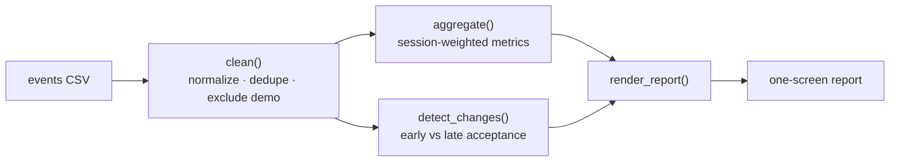

# usage-pulse


A **zero-dependency** Python CLI that turns a messy product-usage events CSV into
a one-screen **weekly health report** — cleaning the data, computing
session-weighted metrics per workflow, and flagging changes worth investigating.

> Why this repo stands out: the interesting part of a usage report isn't the
> averages, it's being **honest about the data**. This tool shows its work —
> every row it drops or excludes is listed — and it session-weights everything
> so a tiny, noisy day can't swing the headline number. Pure standard library,
> fully tested, works out of the box on generated sample data.

## What it reports

```
[1] Data quality        every row cleaned, dropped, or excluded (and why)
[2] Health by workflow  session-weighted completion / acceptance / rating
[3] Looking best         top workflow by acceptance right now
[4] Trust this least     the metric with the weakest support (e.g. sparse ratings)
[5] Change events        workflows whose acceptance fell sharply across the window
```

## How it works



The core (`usage_pulse/report.py`) is pure, deterministic functions with no
third-party dependencies. The CLI is a thin wrapper, so all the logic is
unit-tested directly.

## Quick start

No install needed — Python 3.11+ standard library only.

```bash
# 1. Generate a sample dataset (with intentional data-quality issues baked in)
python -m usage_pulse.generate_data --out data/sample_events.csv

# 2. Run the report
python -m usage_pulse.cli --input data/sample_events.csv
```

### Sample output

```
[1] Data quality
  - row 43: duplicate row for 2026-08-01/reply-draft - dropped
  - row 44: 2026-08-06/search is 'demo' traffic (900 sessions) - excluded from metrics but shown here
  (42 rows used, 1 excluded from metrics)

[2] Health by workflow (session-weighted)
  workflow          sessions  completion  acceptance   rating
  summarize             1055       94.4%       80.5%     4.50
  search                2928       97.9%       60.3%     3.87
  reply-draft           1580       89.9%       59.4%     4.31

[5] Change events to investigate
  reply-draft: acceptance 71.4% -> 47.9% (down 23.5 pts across the window)
```

## Input format

A CSV with one row per workflow per day:

| column | meaning |
| --- | --- |
| `date` | ISO date (`YYYY-MM-DD`) |
| `workflow` | workflow name (casing/whitespace normalized automatically) |
| `source` | traffic source; `demo` / `test` / `internal` are excluded from metrics |
| `sessions` | number of sessions |
| `completed` | sessions that completed the workflow |
| `accepted` | completions the user accepted |
| `avg_rating` | mean user rating (blank / `n/a` allowed) |

## Design decisions

- **Session-weighted, always.** Rates are computed from summed counts
  (`Σaccepted / Σcompleted`), never as an unweighted mean of daily rates — a
  5-session day and a 500-session day should not count equally.
- **Show, don't silently drop.** Every duplicate, impossible-count, or excluded
  row appears in section [1], so the report is auditable.
- **Excluded ≠ deleted.** Demo/test traffic is set aside from metrics but still
  surfaced, so a spike can't quietly inflate the numbers.
- **Ratings are treated with suspicion.** Section [4] calls out any workflow
  whose rating is backed by too few rated sessions.

## Tests

```bash
pip install -r requirements-dev.txt
pytest -q
```

Tests are fully offline and cover cleaning, session-weighting, rating coverage,
and change detection.

## Project layout

```
usage_pulse/
  report.py         core pipeline: clean -> aggregate -> detect_changes -> render
  cli.py            command-line entry point
  generate_data.py  deterministic synthetic data generator
data/               generated sample CSV
tests/              offline unit tests
```

## Roadmap

- Explicit before/after comparison windows around a known change date.
- Threshold-based alerting (exit non-zero on a regression) for CI/cron use.
- JSON / Markdown output formats in addition to the console report.
- Per-workflow sparkline trends.

## License

MIT © 2026 Wei-Ting Yen
